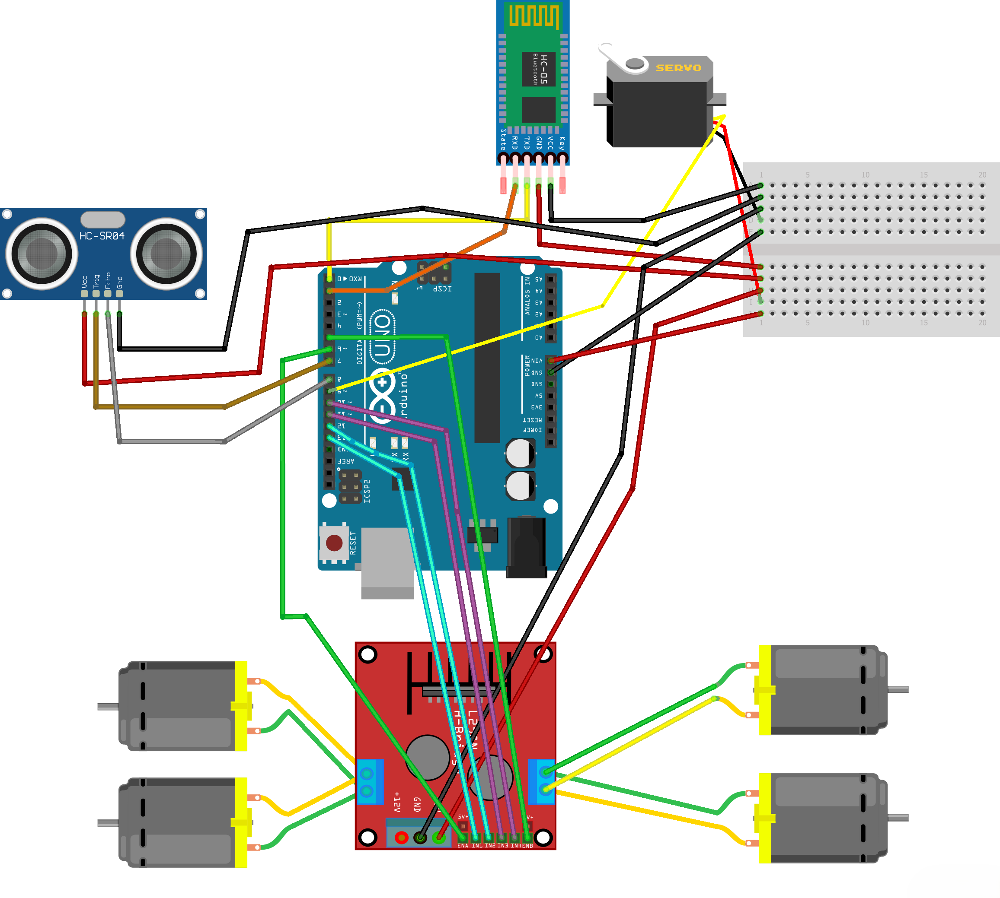

# RC_CAR_WITH_OBSTACLE_AVOIDING

This project is an Arduino-based remote-controlled (RC) car with an added obstacle avoidance feature. The car can be controlled using Bluetooth commands and will automatically avoid obstacles when the obstacle avoidance mode is enabled.

## Features

- **Remote Control via Bluetooth:** The car can be controlled to move forward, backward, left, right, and stop.
- **Speed Control:** Control the speed of the car by sending values from 0 (stop) to 9 (full speed).
- **Obstacle Avoidance:** When obstacle avoidance mode is turned on, the car will detect obstacles in its path using an ultrasonic sensor and automatically avoid them by steering in a clear direction.

## Components Used

- Arduino Uno
- L298N Motor Driver
- 2 DC Motors
- HC-SR04 Ultrasonic Sensor
- SG90 Servo Motor
- Bluetooth Module (HC-05 or HC-06)
- Power Supply (Battery)
- Jumper Wires

## Bluetooth Commands

- **F:** Move forward
- **B:** Move backward
- **L:** Turn left
- **R:** Turn right
- **S:** Stop
- **0 - 9:** Set speed (0 is stop, 9 is maximum speed)
- **W:** Toggle obstacle avoidance mode on/off

## How It Works

- The car can be manually controlled via Bluetooth commands sent from a smartphone or other Bluetooth-enabled device.
- When the obstacle avoidance mode is enabled (`W` command), the ultrasonic sensor mounted on the front of the car scans for obstacles. If an obstacle is detected within a set range (20 cm), the car will stop, and the servo will rotate the sensor to scan left and right to find a clear path before proceeding.

## Circuit Diagram

## Code

The code is available in the `RC_Car_with_Obstacle_Avoiding.ino` file. You can upload this to your Arduino using the Arduino IDE.
